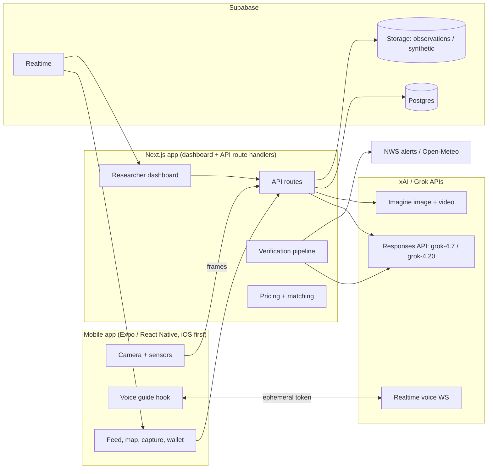

# GroundTruth — Product Requirements Document

**Version:** 0.1 (full product vision + hackathon MVP)
**Team:** 2 people · **Event:** Make it Legendary with SpaceXAI · **Date:** September 26, 2026
**Status:** Draft for build

> **One line:** GroundTruth is a bounty board for reality. Researchers post paid requests for real-world data, Grok finds the right people nearby, coaches them by voice to capture it to a research standard, and refuses anything that isn't real.

---

## 1. TL;DR

Science, cities, and disaster responders are starved for ground truth: street-level observations of what is actually happening, where, and when. Sensors are sparse, satellites miss short-lived events, and the most valuable data (a flooded street, a hailstorm, a crop disease outbreak) disappears within hours.

Billions of phones could fill that gap, but three things have stopped them: people don't know what data is needed or where, casual photos aren't research-grade, and the moment you pay for data, people fake it.

GroundTruth solves all three:

1. **Direction.** Researchers post *bounties* tied to a place, a time window, and a protocol. A pricing engine raises the reward where data is scarce and urgent ("surge pricing for science"), and a matching engine notifies the people best placed to help.
2. **Quality.** A Grok Voice field guide and live Grok vision checks coach the contributor through a standardized protocol. **The shutter stays locked until the shot meets the protocol.**
3. **Trust.** Every submission runs through a layered verification pipeline (challenge-response capture, protocol compliance, authenticity, context plausibility, duplicates, corroboration, reputation) before it is paid and added to a clean, structured dataset.

The MVP proves the loop end to end with one hero protocol, **street flood depth**, plus a red-team console where we attack our own verification with Grok Imagine fakes and show them being caught.

---

## 2. Problem

**Ground truth is the bottleneck.** Flood models, weather models, crop-disease maps, and damage assessments are all calibrated against direct observations, and there are far too few of them. River gauges don't see streets. Satellite passes often miss short-lived events. When a flash flood recedes, the evidence of which streets flooded and how deep goes with it.

**Citizen science works, but not for this.** Projects like eBird, iNaturalist, and CoCoRaHS prove people will contribute. But they are single-domain, rely on people already knowing about them, produce uneven quality, and have no way to direct effort to *where and when* data is scarce or urgent.

**Paying for data fixes motivation and creates fraud.** Incentives bring fake, recycled, staged, and AI-generated submissions, spoofed locations, and duplicates. Any paid data network lives or dies on verification. **Verification is the product.**

---

## 3. Solution: the core loop

```
Researcher posts bounty  →  Pricing engine sets a live price per area (surge where scarce/urgent)
      ↓
Matching engine finds nearby contributors whose skills/routines fit  →  personalized notification
      ↓
Mission briefing: why it matters, safety rules, example "ideal shot" (Grok Imagine), price locked
      ↓
Guided capture: Grok Voice coaches hands-free; live Grok vision checks gate the shutter
      ↓
Challenge-response burst capture + spoken field notes
      ↓
Verification pipeline (7 layers) → accepted / needs review / rejected, with reasons
      ↓
Contributor paid (MVP: simulated wallet)  →  Observation lands in a structured dataset
      ↓
Researcher sees it live on a coverage map and exports CSV / GeoJSON
```

**Why now:** multimodal models can judge a photo against a written protocol in seconds; realtime voice agents can coach someone hands-free in their own language; generative media can show exactly what a good capture looks like, and can also be used to stress-test the fraud defenses.

---

## 4. Users

| Persona | Who | What they need |
|---|---|---|
| **Contributor** | "Maya, 34, civil engineer who walks to work." "Luis, 52, tomato grower." Anyone 18+ with a phone. | Know when they're near valuable data, capture it correctly without reading a manual, get paid quickly, see impact. |
| **Researcher** | Urban hydrology lab, city stormwater engineer, agricultural extension scientist. | Post a data request in minutes, trust what comes back, get it in a clean format with confidence scores and provenance. |
| **Data buyer** (post-MVP) | Insurers, climate-tech and weather companies, AI labs needing real-world ground truth. | Licensed, verified, well-documented data. Funds contributor payouts. |
| **Verifier / admin** | Our team (MVP); later, trusted community reviewers. | Review borderline submissions, run red-team tests, tune thresholds. |

---

## 5. Goals, non-goals, and success metrics

### Hackathon goals
1. Demonstrate the full loop live in under 3 minutes, on a physical phone plus the researcher dashboard.
2. Verification catches every red-team fake in our demo set while accepting honest captures.
3. Grok Voice, Grok vision, and Grok Imagine each do load-bearing work, not decoration.

### MVP performance targets
| Metric | Target |
|---|---|
| Live coaching loop (frame → hint on screen/voice), p50 | < 2.0 s |
| Voice agent first audio after opening capture | < 1.5 s |
| Server verification end to end | < 25 s |
| Honest captures accepted on first attempt after coaching (internal test set) | ≥ 80% |
| Red-team fakes rejected or sent to review | 100% of demo set |

### Product metrics (post-hackathon pilot)
- Fraud pass-through rate on audited samples < 1%
- Time from bounty posted to first accepted observation < 30 min (pilot city)
- Cost per accepted observation (payout + AI cost)
- Coverage: % of target cells filled within the bounty window
- Contributor 30-day retention; researcher repeat bounty rate

### Non-goals for the MVP
Real money movement, public launch, full Android QA (keep it compatible, demo on iPhone), organization/billing management, background location tracking, offline capture queue, automated face/plate redaction.

---

## 6. Product principles

1. **Verification is the product.** Every feature is judged by whether it makes honest data easier and fake data harder.
2. **Safety beats coverage.** No bounty ever rewards moving toward danger. Hazard zones pause captures automatically.
3. **Real only.** Generated media is used for guidance and testing, is always labeled, lives in separate storage, and never enters a dataset.
4. **Protocols, not photos.** Every bounty is backed by a machine-readable protocol that defines what to capture, how, and what structured data comes out.
5. **Hands-free first.** People in the field have their hands full. Voice is the primary interface during capture.
6. **Show the work.** Every accept/reject decision comes with human-readable reasons for the contributor and full check details for the researcher.

---

## 7. End-to-end experience

### 7.1 Onboarding (voice interview, ~60 seconds)
- Permissions: camera, microphone, location (while using the app only).
- Age gate (18+ for paid bounties) and consent to the data license.
- A short Grok Voice conversation builds the profile: occupation, skills, interests, typical areas (home, work, commute described in words), languages, how often they want to be notified. The agent calls a `save_profile` tool with structured fields; the user reviews and edits them on screen.
- MVP fallback: a simple form with the same fields.

### 7.2 Discover opportunities
- **Map view** with active bounties as hexagon coverage and price badges; **"For you" list** sorted by match score.
- **Bounty card:** title, protocol, distance, live price with surge badge (e.g. `$8.40 · ×4.2`), time left, cells still needed, safety level.
- **Notifications** (P1): personalized copy written by Grok, e.g. "You're 300 m from an unmapped flooded block, and your engineering background earns a quality bonus." Rules: max 3 per day, quiet hours, only above the user's minimum reward, never into hazard zones.

### 7.3 Mission briefing
- Why this data matters (2 sentences, from the bounty).
- Safety rules for this protocol, read aloud at the start of capture.
- Example "ideal shot" generated with Grok Imagine and labeled **EXAMPLE — AI-generated**.
- Optional 6–8 s briefing clip from Grok Imagine video (P1, pre-generated).
- **Price quote locked** for the capture session (15 minutes) so surge changes don't move the goalposts mid-capture.

### 7.4 Guided capture (the heart of the product)
States: **Arrive → Safety check-in → Frame → Challenge → Field notes → Submit.**

1. **Arrive.** GPS fix must be inside the bounty area with accuracy ≤ 25 m. Otherwise the screen shows distance and direction.
2. **Safety check-in.** The voice agent opens with a scripted line (sent as a `force_message`, so it is always said verbatim) and asks the protocol's safety question: "Are you on a sidewalk or curb, away from moving water?" A "no" or "I'm not sure" ends the session gracefully with no penalty.
3. **Frame.** The camera overlay shows the protocol's required elements as a checklist (e.g. ☐ Water surface ☐ Reference object ☐ Waterline visible). On-device checks (tilt from motion sensors, steadiness, GPS) run continuously; a live Grok vision check runs roughly every 1.2 s on a downscaled frame. Each result updates the checklist and gives the voice agent a status update to coach from ("I can see the water but not the curb edge. Tilt down a little."). **The shutter unlocks only when every required element is green on two consecutive checks.** A photo of a screen or print is flagged here immediately.
4. **Challenge.** When the user taps the shutter or says "capture," the app issues a random challenge from the protocol's pool ("Take one slow step to your left") and takes a 3-frame burst while they do it. Real 3D scenes show parallax; screens, prints, and pre-made images don't.
5. **Field notes.** The agent asks the protocol's follow-up questions ("Is the water moving or still? Any debris?") and records answers through a `save_field_note` tool as structured fields.
6. **Submit.** Upload, then the verification screen.

Sample exchange:
> **Grok:** You're in the zone. Quick safety check: are you on a sidewalk or curb, away from moving water?
> **User:** Yeah, on the sidewalk.
> **Grok:** Great. Point the camera where the water meets the curb… I see the water but not the curb edge. Tilt down a bit. … That's it, hold still.
> **User:** Capture.
> **Grok:** Now take one slow step to your left. … Got it. Is the water moving or still?
> **User:** Pretty still.
> **Grok:** Thanks. Sending it for verification.

### 7.5 Verification and payout
- An animated checklist shows each verification layer completing in real time (driven by database updates).
- **Accepted:** amount credited to the wallet, with the quality multiplier explained; "Your reading is now on the city's map."
- **Needs review:** "Looks good. A reviewer will confirm within 24 hours." Paid on approval.
- **Rejected for protocol reasons** (missing element, blur): specific fix and a one-tap retry while the session is open.
- **Rejected for integrity reasons** (screen recapture, duplicate, challenge failed): neutral message ("We couldn't verify this capture"), no detailed hints, and the trust score drops.

### 7.6 Researcher: create a bounty
- Choose a protocol (or draft a new one, P1), draw the area (circle or polygon), set the time window, base price, max price, target observations per cell, priority, and total budget.
- Live preview: coverage hexagons and current price per cell.
- **Opportunity Radar (P1):** "Scan for opportunities" pulls active National Weather Service alerts and recent X posts about local conditions, then Grok drafts bounties for the researcher to approve.
- **Protocol Studio (P1):** the researcher describes a data need in plain language ("photos of tomato leaves with spots, top and underside, with a coin for scale"); Grok drafts the full protocol JSON (steps, required elements, challenges, safety, extraction schema); the researcher edits and publishes. This is what makes GroundTruth general-purpose.

### 7.7 Researcher: live operations and data
- **Coverage map:** H3 hexagons shaded by accepted observations vs target; new observations pop in live.
- **Submission stream:** images, extracted fields, every check with its score and evidence, final decision.
- **Review queue:** approve/reject `needs_review` items.
- **Dataset tab:** a table of accepted observations with provenance and confidence; export CSV or GeoJSON with a generated data dictionary.

### 7.8 Red-team console
- Pick an attack: **AI-generated photo** (Grok Imagine renders a realistic fake matching the bounty), **recycled photo** (resubmit a previously accepted image), or **wrong place/time** (valid image, spoofed metadata).
- The system runs the attack through the same pipeline (skipping only the live-session requirement) and shows which layers caught it and why.
- Live version: display a Grok Imagine fake on a laptop and point the phone at it; the capture gate flags the screen before the shutter unlocks.
- Results are stored in `redteam_runs` and never in `submissions`.

---

## 8. The protocol system

A protocol is a versioned JSON document that drives the whole experience: the voice script, the camera checklist, the challenges, the verification prompt, the extraction schema, and the dataset columns. Adding a new kind of data means writing (or having Grok draft) a new protocol, not writing new code.

**Hero protocol for the MVP:**

```json
{
  "slug": "street-flood-depth",
  "version": 1,
  "name": "Street flood depth",
  "why_it_matters": "Urban flood models are calibrated against very few street-level measurements. Depth readings with exact place and time show which streets flood, how deep, and how fast water recedes.",
  "safety": {
    "level": "elevated",
    "check_in_question": "Are you on a sidewalk, curb, or other dry ground, away from moving water?",
    "rules": [
      "Never enter or drive through floodwater.",
      "Stay on dry ground at least 2 meters from moving water.",
      "Captures pause automatically inside life-threatening weather warnings.",
      "If you feel unsafe, stop. There is no penalty for ending a session."
    ]
  },
  "capture": {
    "mode": "burst",
    "frames": 3,
    "frame_interval_ms": 600,
    "orientation": "landscape",
    "max_tilt_deg": 15,
    "required_elements": [
      { "id": "water_surface", "label": "Water surface", "description": "Standing or moving water on a street, sidewalk, or lot." },
      { "id": "reference_object", "label": "Reference object", "description": "An object of known height partly submerged: curb, car tire, fire hydrant, sign post, or measuring stick." },
      { "id": "waterline", "label": "Waterline visible", "description": "The line where water meets the reference object is clearly visible." }
    ],
    "framing_tips": ["Hold the phone level.", "Put the reference object in the middle of the frame.", "Stand 2 to 6 meters away."],
    "challenges": [
      { "id": "step_left", "instruction": "Take one slow step to your left while I capture.", "expect": "Viewpoint shifts left across the burst with consistent parallax." },
      { "id": "step_closer", "instruction": "Take one small step closer while I capture.", "expect": "Reference object grows in frame across the burst." },
      { "id": "tilt_down", "instruction": "Slowly tilt the phone down toward the waterline while I capture.", "expect": "Framing moves downward across the burst." }
    ],
    "field_questions": [
      { "id": "water_state", "question": "Is the water moving or still?", "type": "enum", "options": ["still", "slow", "fast"] },
      { "id": "debris_present", "question": "Do you see debris or trash in the water?", "type": "boolean" }
    ]
  },
  "extraction_schema": {
    "type": "object",
    "properties": {
      "depth_cm": { "type": ["number", "null"], "description": "Estimated water depth at the reference object, in centimeters." },
      "depth_confidence": { "type": "number", "minimum": 0, "maximum": 1 },
      "reference_object_type": { "type": "string", "enum": ["curb", "tire", "hydrant", "sign_post", "measuring_stick", "other"] },
      "reference_object_assumed_height_cm": { "type": ["number", "null"] },
      "surface_type": { "type": "string", "enum": ["road", "sidewalk", "parking_lot", "yard", "other"] },
      "water_state": { "type": "string", "enum": ["still", "slow", "fast", "unknown"] },
      "debris_present": { "type": ["boolean", "null"] },
      "notes": { "type": "string" }
    },
    "required": ["depth_cm", "depth_confidence", "reference_object_type", "surface_type", "water_state"]
  },
  "acceptance": {
    "min_protocol_score": 0.7,
    "min_authenticity_score": 0.8,
    "precipitation_plausibility": { "lookback_hours": 48, "min_total_mm": 5 },
    "corroboration_radius_m": 300,
    "corroboration_window_min": 60
  },
  "example_image_prompt": "Photorealistic landscape street-level photo of shallow floodwater on an urban street reaching halfway up a standard concrete curb and the lower part of a parked car's tire, overcast daylight, camera held level about 3 meters away, waterline clearly visible on the curb and tire. Instructional reference photo."
}
```

**Second protocol (P1): Leaf disease scout** — top and underside of an affected leaf with a coin for scale; extracts symptom type, affected area %, crop. Useful to prove generality and easy to demo indoors with a houseplant. Ideally created live in Protocol Studio.

---

## 9. Verification pipeline

Verification happens in two phases: **before the shutter** (coaching and gating, so most bad captures never happen) and **after upload** (a server pipeline that decides whether to pay).

### 9.1 Before the shutter: the capture gate
| Check | How | Runs on |
|---|---|---|
| In-app camera only | No photo-library import exists anywhere in the app | Device |
| Location in area, accuracy ≤ 25 m | expo-location | Device |
| Level and steady | Motion sensors: tilt within protocol limit, low rotation for 500 ms | Device |
| Required elements visible, framing, blur, light | Grok fast vision on a 640 px frame every ~1.2 s, structured output | Server → Grok |
| Screen or print suspected | Same call flags moiré, pixel grid, bezels, glare, paper edges | Server → Grok |
| Gate | Shutter unlocks after 2 consecutive all-green checks | Device |

### 9.2 After upload: the server pipeline
Each layer writes its result (status, score, reason codes, evidence, duration) into `submissions.checks`, which the phone and dashboard watch in real time.

| # | Layer | What it checks | How |
|---|---|---|---|
| 1 | **Session integrity** | Submission belongs to an open capture session; captured within session window; nonce matches; device metadata consistent | Server-issued session, nonce, expiry; photo metadata |
| 2 | **Challenge-response** | The random challenge was actually performed; burst shows real 3D parallax | Grok reasoning vision compares the 3 frames |
| 3 | **Protocol compliance + extraction** | Required elements present; quality; structured fields extracted | Grok reasoning vision + protocol extraction schema (strict structured output) |
| 4 | **Authenticity** | Screen recapture, printed photo, AI-generation signs, compositing/editing, internal inconsistencies (dry pavement next to "flood", shadows) | Grok reasoning vision (skeptical prompt, evidence required) |
| 5 | **Context plausibility** | Inside bounty area; recent precipitation near the point; active/recent weather alerts; daylight in image matches local sun position at capture time | Geometry check, Open-Meteo past precipitation, NWS alerts, sun-position library |
| 6 | **Duplicates and velocity** | Near-identical to any prior image; too many submissions per cell per hour; impossible travel speed between a user's submissions | Perceptual hash (Hamming distance), rate rules |
| 7 | **Corroboration and reputation** | Agreement with nearby accepted observations (≤ 300 m, ≤ 60 min); contributor trust score | Database query; trust score |

### 9.3 Decision rules
- **Hard fail → rejected:** invalid/expired session, outside area, duplicate, challenge failed, screen/print recapture or AI-generated with confidence ≥ 0.8.
- **Otherwise compute confidence** as a weighted blend of protocol score, authenticity score, context, and corroboration/trust.
  - ≥ 0.75 → **accepted**
  - 0.50–0.75, or trust score < 0.3 → **needs review**
  - < 0.50 → **rejected**
- Protocol-quality failures (missing element, blur) can be retried within the session; integrity failures cannot.

**Reason codes:** `SESSION_INVALID`, `SESSION_EXPIRED`, `OUTSIDE_AREA`, `CHALLENGE_FAILED`, `MISSING_ELEMENT:<id>`, `BLURRY`, `TOO_DARK`, `SCREEN_RECAPTURE`, `PRINTED_PHOTO`, `AI_GENERATED_SUSPECTED`, `EDITED_SUSPECTED`, `DUPLICATE`, `VELOCITY_LIMIT`, `IMPOSSIBLE_TRAVEL`, `WEATHER_IMPLAUSIBLE`, `DAYLIGHT_MISMATCH`, `LOW_TRUST_REVIEW`.

**Trust score:** starts at 0.5; +0.02 per accepted observation (cap 0.95); −0.05 per protocol rejection; −0.25 per integrity rejection; review outcomes adjust both ways.

### 9.4 Honest limitations
A determined attacker who physically stages a scene can pass visual checks. The goal is not perfection; it is making fraud more expensive than honest work. That is why corroboration, reputation, audits, and (post-MVP) device attestation exist. Depth values are *estimates with confidence*, and researchers always see the confidence and evidence.

---

## 10. Pricing engine

Each H3 cell (resolution 9, roughly 0.1 km²) in a bounty area gets a live price:

```
price = clamp(base × S × U × P, base, max_price)

S (scarcity) = 1 + α · max(0, 1 − accepted_in_cell / target_per_cell)      α = 2   → up to ×3 when a cell is empty
U (urgency)  = 1 + β · exp(−hours_since_event_start / τ)                    β = 1, τ = protocol-specific (flood: 3 h)
P (priority) = researcher-set multiplier (default 1.0; later: number of buyers)
surge        = price / base
```

**Worked example** (base $2, max $10, target 5 per cell, τ = 3 h):
- Empty cell, 30 min after the event starts: 2 × 3.0 × 1.85 = $11.08 → capped at **$10.00 (×5.0)**
- 4 of 5 filled, 2 h after start: 2 × 1.4 × 1.51 = **$4.24 (×2.1)**

**Payout** = locked quote × quality multiplier (0.8–1.2, from protocol score). Bounties stop issuing sessions when the budget is exhausted.

**Safety overrides:** cells intersecting life-threatening warnings (e.g. Flash Flood Emergency, Tornado Warning) are **paused**: the price is shown but capture is disabled, with an explanation. Urgency never applies inside a hazard polygon. The goal is to reward the safe "during and after" window, never to reward rushing toward danger.

---

## 11. Matching and notifications

```
match = 0.40 · proximity + 0.30 · skill_fit + 0.20 · value + 0.10 · trust
```
- **proximity:** distance from the user's current location (only while app open in MVP) or described regular areas.
- **skill_fit:** 0–1 from a fast Grok call per (user, bounty) pair, cached, which also returns a one-sentence reason and the notification copy.
- **value:** normalized current price.
- **trust:** the user's trust score.

Notifications (P1) use local notifications in the MVP and Expo push later. Rules: max 3/day, quiet hours, minimum reward threshold, never into paused cells.

---

## 12. Grok integration map

| Surface | Model / endpoint | Used for | Latency budget |
|---|---|---|---|
| **Grok Voice (realtime)** | `grok-voice-latest` over `wss://api.x.ai/v1/realtime`, ephemeral token from our server | Onboarding interview; field guide; safety check-in; live coaching from camera status; voice-triggered capture; spoken field notes → structured fields (function tools) | First audio < 1.5 s |
| **Grok fast vision** | `grok-4.20-non-reasoning` via `/v1/responses` (structured outputs) | Live frame checks; match scoring; notification copy | < 1.5 s per call |
| **Grok reasoning vision** | `grok-4.7` via `/v1/responses` (structured outputs) | Final verification and extraction; protocol drafting (Protocol Studio); Opportunity Radar with X Search + web search | < 20 s |
| **Grok Imagine (image)** | `grok-imagine-image-2.0` via `/v1/images/generations` | "Ideal shot" example per protocol; red-team fakes; impact cards | Async, cached |
| **Grok Imagine (video)** | `grok-imagine-video-1.5` via `/v1/videos/generations` | 6–8 s mission briefing clips (9:16) | Async (minutes), pre-generated |
| **Grok STT / TTS** | `/v1/stt`, `/v1/tts` | Push-to-talk fallback if realtime audio misbehaves on device | — |

All model names are environment variables so they can be swapped without code changes.

---

## 13. Safety, privacy, and ethics

- **Physical safety:** protocol safety rules, spoken check-in, automatic pause in hazard cells, no reward for approaching hazards, "stop anytime, no penalty."
- **Location privacy:** location is read only while the app is open; no background tracking in the MVP. Profiles describe regular areas in words, not traces.
- **Bystander privacy:** raw images stay in a private bucket accessible only to approved researchers; public exports contain structured data and no images by default. Automated face/plate redaction is on the roadmap.
- **Consent and licensing:** contributors grant a clear license at onboarding (proposed: open tier under CC BY 4.0 with attribution to "GroundTruth contributors"; commercial licensing funds payouts). Final terms are an open question.
- **Synthetic media policy:** every generated asset is labeled, stored in a separate `synthetic` bucket, tracked in `synthetic_media`, and structurally unable to reach `submissions` or exports.
- **Equity:** scarcity pricing naturally pushes rewards toward under-covered areas rather than wherever users already are. Voice-first, multilingual capture lowers literacy barriers.
- **Payments:** 18+ for paid bounties; identity verification and tax handling come with real payouts (post-MVP).
- **Model limits:** estimates are labeled as estimates with confidence; borderline cases go to humans.

---

## 14. Architecture



**Decision log**
- **Expo (React Native) over Swift:** one language (TypeScript) across mobile, web, and shared logic (protocol types, pricing, decision rules); faster iteration with Claude Code; iOS and Android from one codebase. Requires a development build (not Expo Go) for camera and audio native modules. Risk: realtime audio, mitigated by `react-native-audio-api` and an early spike. If a team member is strong in Swift, xAI publishes an official Swift iOS voice tester app as a reference.
- **Next.js route handlers as the API:** one deployable for dashboard + API; long pipeline work runs after responding via `after()`.
- **Supabase:** Postgres, file storage, realtime subscriptions, and auth in one managed service; realtime drives the animated verification checklist and the live map.
- **Voice connects phone → xAI directly** using short-lived ephemeral tokens minted by our server. The API key never touches the phone.
- **H3 hexagons (resolution 9)** for coverage, pricing, and scarcity, computed in shared code with `h3-js`.

---

## 15. Data model (Supabase / Postgres)

| Table | Key columns |
|---|---|
| `profiles` | `id` (= auth user), `role` (contributor/researcher/admin), `display_name`, `occupation`, `skills[]`, `interests[]`, `languages[]`, `regular_areas` jsonb, `notification_prefs` jsonb, `trust_score` (0.5), `is_adult`, `onboarding` jsonb |
| `protocols` | `id`, `slug`, `version`, `name`, `definition` jsonb, `example_image_path`, `status` (draft/published), `created_by` |
| `bounties` | `id`, `protocol_id`, `created_by`, `title`, `summary`, `area` GeoJSON, `center_lat/lng`, `radius_m`, `h3_res`, `cells[]`, `starts_at`, `ends_at`, `event_started_at`, `base_price_cents`, `max_price_cents`, `target_per_cell`, `priority`, `budget_cents`, `spent_cents`, `status` (draft/active/paused/closed), `source` (manual/nws/radar/demo), `briefing_video_path` |
| `capture_sessions` | `id`, `bounty_id`, `user_id`, `nonce`, `challenge` jsonb, `price_quote_cents`, `quote_expires_at`, `started_at`, `expires_at`, `status` (open/submitted/expired/abandoned), `frame_checks` count |
| `submissions` | `id`, `session_id`, `bounty_id`, `user_id`, `media` jsonb (paths, dims, metadata), `lat`, `lng`, `accuracy_m`, `h3_cell`, `captured_at`, `received_at`, `device` jsonb, `sensors` jsonb, `field_notes` jsonb, `status` (pending/verifying/accepted/rejected/needs_review), `checks` jsonb, `reason_codes[]`, `confidence`, `protocol_score`, `authenticity_score`, `extracted` jsonb, `phashes[]`, `payout_cents` |
| `ledger_entries` | `id`, `user_id`, `submission_id`, `amount_cents`, `kind` (payout/bonus/adjustment/reversal), `created_at` — wallet balance is the sum |
| `weather_alerts` | NWS alert cache: `id`, `event`, `severity`, `headline`, `geometry`, `onset`, `expires` |
| `match_cache` | `user_id`, `bounty_id`, `skill_fit`, `reason`, `notification_copy`, `computed_at` |
| `synthetic_media` | `id`, `kind` (example/briefing/redteam/impact), `path`, `prompt`, `model`, `created_at` |
| `redteam_runs` | `id`, `bounty_id`, `attack_type`, `synthetic_media_id`, `pipeline_result` jsonb, `caught`, `created_at` |

**Storage buckets:** `observations` (private), `synthetic` (labeled; readable by the app).
**View:** `observations_export` — accepted submissions flattened with protocol extraction fields, provenance, confidence.
**Realtime:** `submissions`, `bounties`.

---

## 16. API surface

**Contributor**
- `POST /api/voice/token` → ephemeral realtime token
- `GET /api/bounties/nearby?lat&lng&radius_km` → active bounties with live price, surge, distance, match, paused cells
- `GET /api/bounties/:id`
- `POST /api/capture/sessions` → session id, challenge, locked price quote, expiry, signed upload URLs
- `POST /api/capture/frame-check` → live checklist result + coaching hint
- `POST /api/submissions` → creates submission, starts pipeline
- `GET /api/me/wallet`
- `POST /api/profile`

**Researcher / admin**
- `POST /api/bounties`, `PATCH /api/bounties/:id`
- `GET /api/bounties/:id/coverage` → cells with counts and current price
- `GET /api/bounties/:id/export?format=csv|geojson`
- `POST /api/submissions/:id/review`
- `POST /api/protocols/:id/example-image`
- `POST /api/protocols/draft` (P1), `POST /api/protocols/:id/publish` (P1)
- `POST /api/radar/scan` (P1)
- `POST /api/bounties/:id/briefing-video` (P1)
- `POST /api/redteam/run`
- `POST /api/demo/spawn-event` (demo mode only)

---

## 17. MVP scope

| Priority | Feature |
|---|---|
| **P0** | Seeded researcher + flood-depth protocol + demo bounty |
| **P0** | Mobile: bounty map + list with live price and surge badge; bounty detail with briefing and example image |
| **P0** | Guided capture: sensors + live Grok frame checks + checklist overlay + shutter gate + screen/print detection |
| **P0** | Challenge-response burst capture and upload |
| **P0** | Grok Voice field guide: safety check-in, coaching from camera status, "capture" by voice, field notes via tools |
| **P0** | Verification pipeline layers 1–6, simplified layer 7, decision rules, reason codes, realtime checklist on phone |
| **P0** | Pricing engine + locked quotes + simulated wallet ledger |
| **P0** | Dashboard: bounty creation, live coverage map, submission stream with check details, review queue, CSV/GeoJSON export |
| **P0** | Grok Imagine example images per protocol |
| **P0** | Red-team console (AI-generated + recycled attacks) |
| **P0** | Demo mode and mock mode |
| **P1** | Voice onboarding → profile → match scoring → personalized local notifications |
| **P1** | Opportunity Radar (NWS alerts + X Search → drafted bounties) |
| **P1** | Protocol Studio + second protocol (leaf disease scout) |
| **P1** | Grok Imagine briefing videos |
| **P2** | Remote push, Stripe Connect payouts, device attestation (App Attest / Play Integrity), face/plate redaction, offline queue, Android polish, multilingual UI, impact recap cards |

**Explicitly cut from the MVP:** real payments, org management, background location, public launch.

---

## 18. Build plan (2 people)

Assumes roughly 36 working hours; scale the phases proportionally if your event is shorter. The two tracks meet at the shared contracts in `packages/shared`, which are written first.

| Phase | Person A — Mobile | Person B — Platform |
|---|---|---|
| **0. Foundations** (0–3 h) | Expo dev build running on a real iPhone. **Voice spike:** connect to Grok Voice, speak, hear it reply (highest technical risk). | Monorepo, Supabase project, schema, seed, shared zod contracts, mock mode, dashboard skeleton. |
| **1. Skeleton loop with mocks** (3–10 h) | Feed/map, bounty detail, camera capture, upload, verification screen via realtime. | Sessions, submissions, pipeline skeleton writing each stage to `checks`, dashboard live stream. |
| **2. Real vision** (10–18 h) | Frame-check loop, checklist overlay, shutter gate, challenge burst. | Verification prompts + structured outputs, context checks, pHash, decision logic + unit tests. |
| **3. Voice + economy** (18–24 h) | Full voice field guide with tools and camera-status injection. | Pricing, locked quotes, wallet, coverage heatmap, export, Imagine example images. |
| **4. Wow features** (24–30 h) | Polish capture UX, haptics, accepted/paid moment. | Red-team console, demo mode, one or two P1 features. |
| **5. Freeze** (30–36 h) | Bug fixes only. Rehearse the demo three times. Record a backup video. | Same, plus pitch slides. |

**Rules:** feature freeze at the start of Phase 5; always keep `main` demo-able; bring a phone hotspot; pre-generate all Imagine media.

---

## 19. Demo script (3 minutes)

| Time | Beat |
|---|---|
| 0:00–0:20 | **Hook.** "When a flash flood hits, cities have almost no idea which streets flooded or how deep. By the time anyone looks, the water, and the data, are gone." |
| 0:20–0:45 | **Researcher posts a bounty** (or Opportunity Radar drafts one from a live alert). The coverage map lights up; empty cells surge to ×5. |
| 0:45–1:00 | **Phone buzzes** with a personalized notification. Briefing shows the Grok Imagine example shot; price locks. |
| 1:00–1:50 | **Live capture.** Grok Voice runs the safety check. First framing misses the reference object: shutter stays locked and Grok says exactly what's missing. Fix it, checklist goes green, "capture," challenge ("step left"), burst, spoken field note. |
| 1:50–2:15 | **Verification** checklist animates, accepted, wallet credited. On the dashboard, the observation appears on the map and in the dataset with depth estimate and confidence. |
| 2:15–2:40 | **Red team.** Generate a fake flood photo with Grok Imagine and push it through: rejected with reasons. Then point the phone at the fake on a laptop screen: the capture gate flags it instantly. |
| 2:40–3:00 | **Vision.** Any protocol, any place: flood depth today, crop disease, hail, smoke, algal blooms tomorrow. "Every phone becomes a verified scientific instrument." |

**Staging the capture indoors:** a clear tub of water with a ruler standing in it (reference object: measuring stick). Demo mode waives the precipitation plausibility check and shows it as "waived (demo)" on screen, never hidden. Keep a pre-recorded real outdoor capture as backup.

---

## 20. Risks and mitigations

| Risk | Mitigation |
|---|---|
| Realtime voice on React Native is flaky (echo, latency, audio session conflicts with the camera) | Spike in Phase 0; iOS `playAndRecord` + voice-chat mode for echo cancellation; fallback to push-to-talk using `/v1/stt` + `/v1/tts` |
| Frame-check latency or cost too high | 640 px JPEG, fast non-reasoning model, one request in flight, only when device checks pass, per-session cap |
| Honest captures wrongly rejected | Tune on a ~20-image internal test set; wide needs-review band; specific retry guidance |
| Fakes slip through | Layered checks; red-team set; corroboration and trust; honest framing of limits |
| No real flood during the demo | Demo mode + staged tub scene + backup video |
| Venue Wi-Fi | Phone hotspot; pre-generated media; mock mode as last resort |
| Scope creep ("general purpose") | One hero protocol in P0; generality shown via Protocol Studio only if time allows |
| Judges' safety and ethics concerns | Safety check-in and hazard pause are visible in the demo |
| API names or parameters change | Model names in env vars; verify against docs.x.ai |

---

## 21. Roadmap (after the hackathon)

- **Pilot (1–3 months):** one city stormwater team or university hydrology lab; device attestation; Stripe Connect payouts; face/plate redaction; offline capture.
- **Platform (3–9 months):** Protocol Studio for any researcher; protocol library (hail size, wildfire smoke, algal blooms, invasive species, crop disease, road hazards, storm damage); researcher API; open data tier plus commercial licensing; interoperability with standards such as Darwin Core (biodiversity) and OGC SensorThings (environmental sensing).
- **Scale:** multilingual voice-first capture for low-literacy regions; partnerships with humanitarian and disaster-response organizations; data buyers funding a global network of paid, verified observers.

---

## 22. Open questions

1. Who pays first in a real pilot: city, university, insurer, or AI lab?
2. Final data license and contributor image rights.
3. Minimum payout and tax handling once real money flows.
4. Liability posture for hazard-adjacent protocols.
5. Confirm the hackathon's tooling requirements (the brief says to build with Cursor and Grok).

---

## Appendix A — xAI API notes (checked September 26, 2026; re-verify at docs.x.ai)

- **Base URL:** `https://api.x.ai/v1`. OpenAI-SDK compatible. The **Responses API** (`/v1/responses`) is primary; Chat Completions is legacy.
- **Models:** `grok-4.7` (flagship, reasoning, image input); `grok-4.20-non-reasoning` (fast; text + image in; function calling; structured outputs).
- **Image input:** `{"type": "input_image", "image_url": "data:image/jpeg;base64,...", "detail": "high"}`; jpg/png up to 20 MiB. Docs advise not storing history for image requests (`store: false`).
- **Structured outputs (Responses API):** `text: { format: { type: "json_schema", name, schema, strict: true } }`. `additionalProperties` defaults to false; nullable via `["type","null"]`.
- **Server-side tools on Responses:** `web_search`, `x_search` (used by Opportunity Radar).
- **Image generation:** `POST /v1/images/generations`, `model: "grok-imagine-image-2.0"`, `aspect_ratio` (e.g. `"16:9"`), `response_format: "b64_json"` (URLs are temporary). Around $0.02–0.05 per image.
- **Video generation:** `POST /v1/videos/generations` → `{ request_id }`; poll `GET /v1/videos/{request_id}` until `status` is `done` (`video.url`), `failed`, or `expired`. `model: "grok-imagine-video-1.5"`, `duration` 1–15 s, `aspect_ratio` `"9:16"`, `resolution` `"720p"`. Can take several minutes. Around $0.05–0.08 per second.
- **Realtime voice:** `wss://api.x.ai/v1/realtime?model=grok-voice-latest` (currently aliases `grok-voice-think-fast-2.0`). OpenAI Realtime–compatible events (`session.update`, `input_audio_buffer.append`, `response.create`, `response.function_call_arguments.done`, `conversation.item.create`); some output events use OpenAI's beta names, so handle both `response.output_audio.delta` and `response.audio.delta`. Default audio PCM16 at 24 kHz; `turn_detection: { type: "server_vad" }`; `reasoning.effort: "none"` lowers latency; xAI extension `force_message` speaks a scripted line verbatim. Around $0.08 per minute.
- **Ephemeral tokens:** server calls `POST /v1/realtime/client_secrets` with `{ "expires_after": { "seconds": 300 } }` using the API key; the client connects with `Authorization: Bearer <token>` (React Native's WebSocket accepts a headers option) or, in browsers, the subprotocol `xai-client-secret.<token>`.
- **Speech-to-text / text-to-speech:** `/v1/stt`, `/v1/tts` (fallback path).

## Appendix B — Other external services

- **NWS alerts:** `https://api.weather.gov/alerts/active?point={lat},{lon}` — free, requires a descriptive `User-Agent` header, US only.
- **Open-Meteo:** `https://api.open-meteo.com/v1/forecast?latitude=..&longitude=..&hourly=precipitation&past_days=2` — free, no key.
- **H3:** `h3-js` for hexagon indexing. **Sun position:** `suncalc`. **Perceptual hash:** `sharp` + a dHash implementation.
- **Maps:** MapLibre GL with OpenFreeMap tiles on web (no key); `react-native-maps` on mobile (Apple Maps on iOS, no key).
